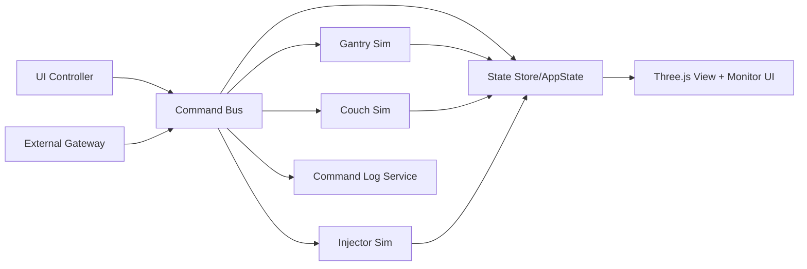
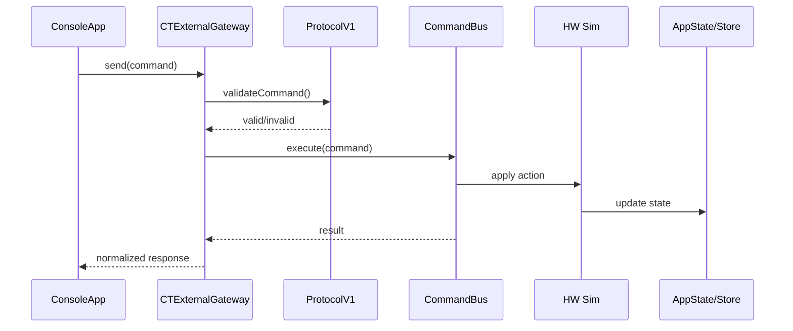

# CT 3D Simulator

CT検査室の3Dシミュレータです。  
UI操作と外部コマンドの両方で、仮想HW（ガントリ/寝台/インジェクタ）を制御できます。

## Quick Start
1. `index.html` をブラウザで開く
2. UIで操作する
3. 必要に応じて `window.CTExternalGateway` から外部制御する

## Run
Open `index.html` in a browser.

## Repository Map
- `index.html`: メインエントリ（推奨）
- `assets/css/ct-simulator.css`: スタイル
- `assets/js/core/`
  - `store.js`: 状態ストア接続
  - `state.js`: 初期状態定義
  - `commands/command-bus.js`: 操作コマンドの実行入口
  - `hw/*.js`: 仮想HW（gantry/couch/injector）
  - `services/sequence-service.js`: シーケンス実行補助
  - `services/command-log-service.js`: コマンド監査ログ
  - `main.js`: アプリ起動・制御フロー（モデル実装は分離済み）
- `assets/js/view/models/`
  - `room-model.js`: 検査室/共通形状
  - `gantry-model.js`: ガントリモデル
  - `injector-model.js`: インジェクタモデル
  - `control-room-model.js`: 操作室モデル
  - `server-rack-model.js`: サーバラックモデル- `assets/js/adapters/`
  - `ui/ui-controller.js`: UIイベント束縛と監視表示
  - `external/protocol-v1.js`: 外部I/Fバリデーション
  - `external/external-gateway.js`: 外部API公開
- `docs/`: 要求仕様・実装方針・I/F仕様・完了レポート

## Architecture (UML)




## External Control API
ブラウザコンソールや連携コードから利用できます。

```js
// 1) スキャン開始
window.CTExternalGateway.send({
  requestId: "req-001",
  target: "gantry",
  action: "setScanning",
  params: { value: true }
});

// 2) 寝台移動
window.CTExternalGateway.send({
  requestId: "req-002",
  target: "couch",
  action: "moveZ",
  params: { value: 65 }
});

// 3) 状態取得
window.CTExternalGateway.getState();
```

## Diagnostics / Debug
```js
// 状態変更購読
const unsubscribe = window.CTExternalGateway.subscribe((event) => {
  console.log(event.success, event.payload);
});

// 直近コマンドログ取得
window.CTExternalGateway.diagnostics.getRecentCommands();

// ログクリア
window.CTExternalGateway.diagnostics.clearCommandLog();
```

## Validation
```powershell
node --check assets/js/core/main.js
node --check assets/js/adapters/external/protocol-v1.js
node scripts/verify-external-interface.js
```

## Specs
- `docs/CT_Simulator_要求仕様書.md`
- `docs/CT_Simulator_実装方針_設計書.md`
- `docs/CT_External_Command_IF_v1.md`
- `docs/Phase5_完了レポート.md`

## Notes
- 互換エントリとして `onefile.html` と `ct-simulator.html` を保持しています。
- 開発・運用の基準エントリは `index.html` です。

## Model Customization (Low-Complexity)
機種差分は基本的に次の1ファイルを変更します。
- `assets/js/core/profile/default-profile.js`

主な変更項目:
- `capabilities.gantry.detectorRows.options`
- `capabilities.couch` / `capabilities.injector` の制御範囲
- `mappings.couchWorld` / `mappings.detectorRows` の3D反映係数

共通ロジック（Command Bus / UI / 3D本体）はそのまま使えるため、
機種変更時の変更範囲を最小化できます。

