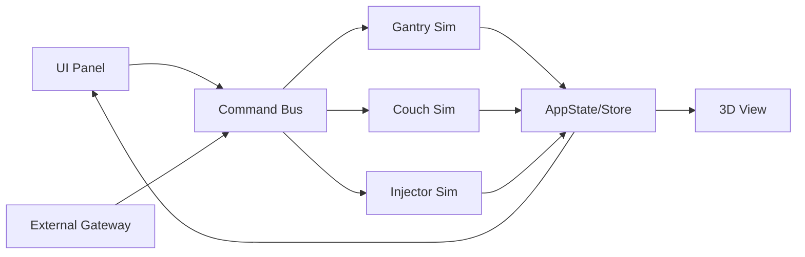

# CT 3D Simulator

CT操作コンソールを模擬するための3Dシミュレータです。  
ガントリ・寝台・インジェクタをHWシミュレータとして提供し、UI操作と外部コマンド操作を同じ制御経路で扱います。

## このリポジトリの目的
- CT装置操作の試験・検証用シミュレータを提供する
- 実機の代わりに仮想HWを外部アプリへ公開する
- UIを置き換えても動く制御基盤を維持する

## 現在の構成
```text
.
├─ index.html
├─ README.md
├─ docs/
│  ├─ CT_Simulator_要求仕様書.md
│  ├─ CT_Simulator_実装方針_設計書.md
│  ├─ UI_再設計書.md
│  ├─ CT_External_Command_IF_v1.md
│  └─ Phase5_完了レポート.md
├─ assets/
│  ├─ css/ct-simulator.css
│  └─ js/
│     ├─ core/
│     ├─ adapters/
│     └─ view/models/
└─ scripts/verify-external-interface.js
```

## アーキテクチャ要約
- `core/`: 状態・コマンド・HW制御・シーケンス
- `adapters/ui/`: UIイベントをコマンドへ変換、状態をUIへ反映
- `adapters/external/`: 外部コマンドI/F
- `view/models/`: 3Dモデル定義



## UI初期表示仕様
- 初期表示: `Console` / `HW STATE MONITOR`
- 初期非表示: `HW設定` / `3D表示・操作` / `Command Log`
- ツールバーから各パネルを個別表示、同時表示可能

## 外部I/F要約
- `window.CTExternalGateway.send(command)`
- `window.CTExternalGateway.getState()`
- `window.CTExternalGateway.subscribe(listener)`

詳細: [CT_External_Command_IF_v1.md](/x:/ctcode/three_ct/docs/CT_External_Command_IF_v1.md)

## 関連ドキュメント
- 要求仕様: [CT_Simulator_要求仕様書.md](/x:/ctcode/three_ct/docs/CT_Simulator_要求仕様書.md)
- 実装方針: [CT_Simulator_実装方針_設計書.md](/x:/ctcode/three_ct/docs/CT_Simulator_実装方針_設計書.md)
- UI設計: [UI_再設計書.md](/x:/ctcode/three_ct/docs/UI_再設計書.md)
