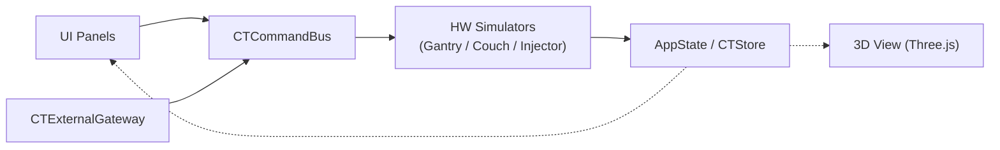

# CT 3D Simulator

Webブラウザ上で動作するCT装置（ガントリ・寝台・インジェクタ）の3Dリアルタイムシミュレータです。  
UI操作と外部APIからの遠隔操作を同一の制御基盤（Command Bus）で共通処理します。

---

## 1. 概要
- **目的**: CT装置操作の試験・検証用仮想ハードウェア（HW）の提供
- **特徴**: 
  - Three.jsによる3D空間表示とリアルタイム制御
  - コンソールUIと外部API (`window.CTExternalGateway`) の同一制御経路化
  - UIや実機接続の変更に柔軟に対応できるアダプター設計

---

## 2. 使い方

### 2.1 セットアップ（外部ライブラリの取得）
初回起動時、または外部ライブラリを更新・再取得する場合は、Git Bash (Windows) または Linux / macOS ターミナルで `setup.sh` を実行します。
Three.js 本体・各種アドオン、Tween.js、Tailwind CSS 等を `assets/vendor/` へ自動ダウンロードします。
```bash
bash setup.sh
```

### 2.2 起動方法
HTTPサーバー（`npx serve` や Live Server など）を立ち上げ、ブラウザで `index.html` にアクセスします。
```bash
npx serve .
```

### 2.3 動作検証コマンド
外部I/Fプロトコルおよび動作を自動検証します。
```bash
node scripts/verify-external-interface.js
```

### 2.3 リアルタイム動画配信サーバーの起動 (HTTP MJPEG / RTSP)
`http://127.0.0.1:8080/live/ct-camera.mjpg` で外部ブラウザやVLCプレイヤーから閲覧する場合は、ストリーミングサーバーを起動します。
```bash
node scripts/stream-server.js
```

### 2.3 外部APIでの操作例
ブラウザのコンソールや外部アプリケーションから直接操作が可能です。
```javascript
// スキャン開始
window.CTExternalGateway.send({ target: 'gantry', action: 'setScanning', params: { value: true } });

// 寝台Z軸移動 (65mm)
window.CTExternalGateway.send({ target: 'couch', action: 'moveZ', params: { value: 65 } });

// 状態変更のリアルタイム購読
window.CTExternalGateway.subscribe((event) => console.log('状態更新:', event.payload));
```

---

## 3. 設計（アーキテクチャ）

UIと外部通信アダプターが同一の `CTCommandBus` を介してHWシミュレータを制御し、`AppState` の変更がUIと3D表示へ自動伝播します。



---

## 4. 関連ドキュメント (`docs/`)

詳細な仕様および設計は以下のドキュメントを参照してください。

| ドキュメント | 内容 |
| :--- | :--- |
| 📄 **[01_requirements.md](docs/01_requirements.md)** | 要求仕様書（機能要件、非機能要件、受け入れ基準） |
| 📄 **[02_architecture_design.md](docs/02_architecture_design.md)** | システム設計書（アーキテクチャ、UIパネル設計、UML図） |
| 📄 **[03_external_api_spec.md](docs/03_external_api_spec.md)** | 外部API仕様書（通信プロトコル、電文構造、エラー一覧） |
