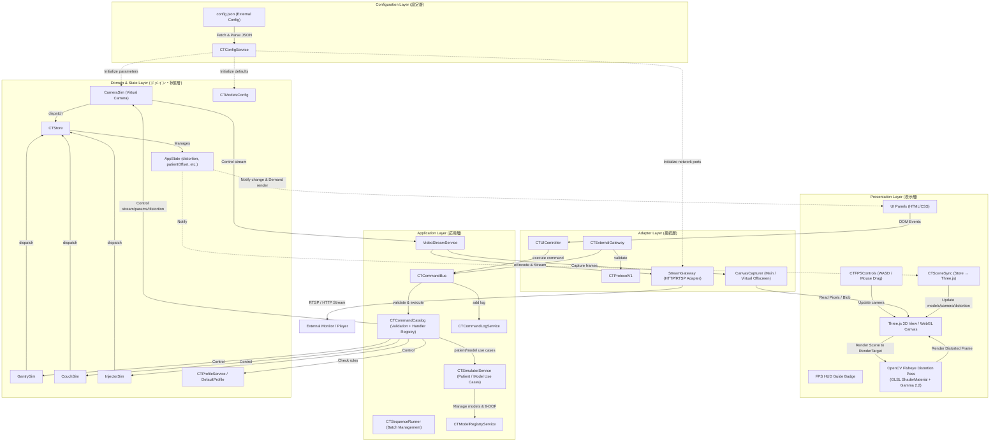
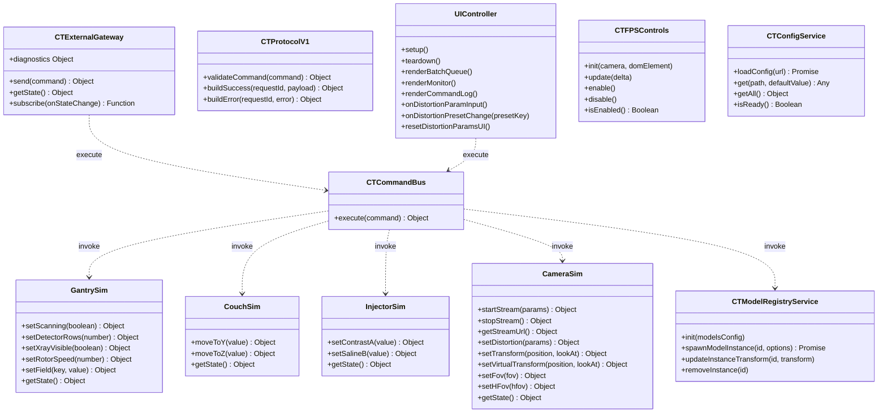
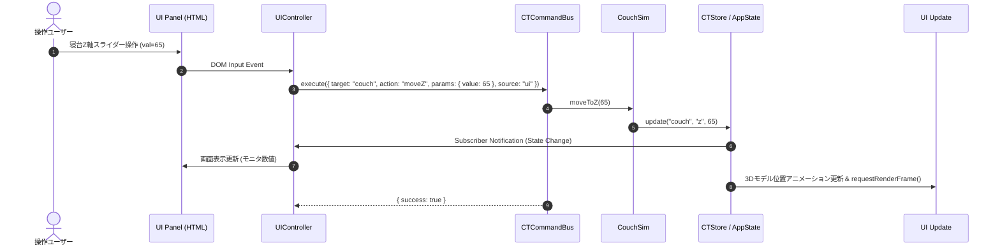
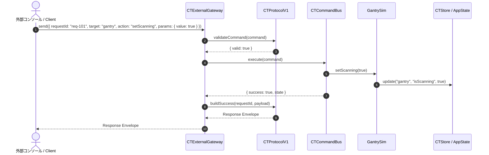
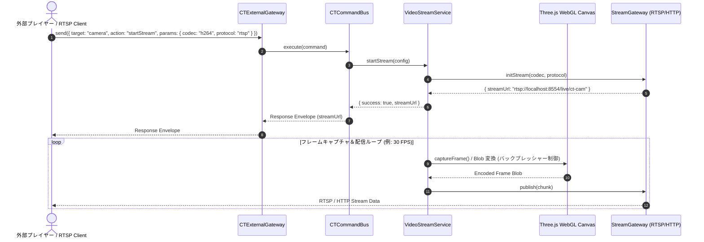
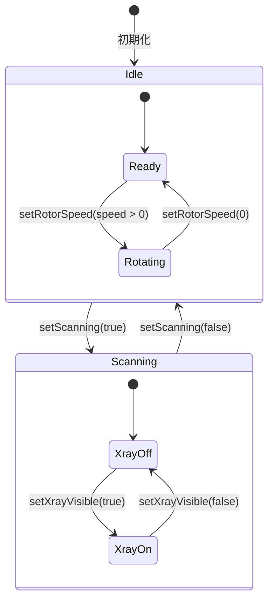
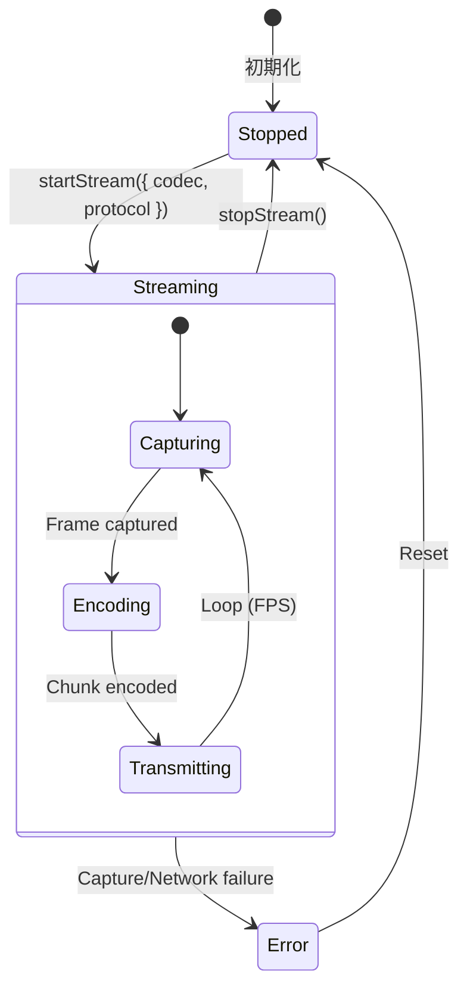
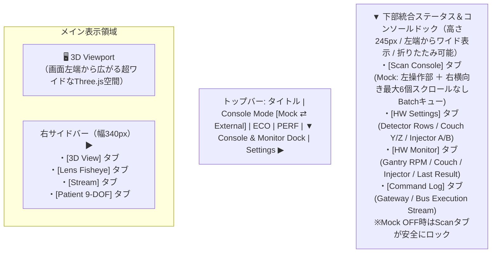

# CT 3D Simulator システム設計・アーキテクチャ仕様書

## 1. 設計原則
- **UIと外部I/Fの同一化**: UI操作および外部APIからの制御は、すべて単一の `Command Bus` 経路を経由して同一のロジックで実行する。
- **ドメインの独立性**: 仮想HWシミュレータ（Domain）と表示部（Presentation: 3D描画 / UIパネル）を完全に分離し、相互参照を排除する。
- **設定と実装の分離**: 検出器列数や回転速度制限などの機種差分は `ProfileService`（設定層）および `CTConfigService` / `CTModelsConfig` / `CTModelRegistry`（設定・モデル管理層）に切り出し、HWロジックと分離する。
- **単一状態管理 (Single Source of Truth)**: 全システム状態を `AppState` に一元管理し、`CTStore` の Pub/Sub 機構により画面・3Dモデルへ変更を伝播する。
- **エコモード・省電力レンダリング**: 画面静止時は再描画処理をスキップし、状態変化やカメラ操作時のみ要求ベース（Demand-driven）で描画を実行する。

---

## 2. アーキテクチャ概要 (コンポーネント図)

システム全体のコンポーネント関係およびレイヤ境界を以下に示します。



---

## 3. モジュール設計とインターフェース (クラス/モジュール図)

主要なモジュール、公開メソッド、および相互参照関係を定義します。



---

## 4. コントロールフローとシーケンス図

### 4.1 UI操作シーケンス (コンソール/操作画面)



### 4.2 外部API操作シーケンス (遠隔制御)



### 4.3 仮想カメラ映像配信シーケンス (カメラストリーミング)



---

## 5. カメラ歪曲シェーダーパイプライン設計

### 5.1 数学モデル（OpenCV Fisheye / Kannala-Brandt モデル）
標準のピンホールカメラ像 $(x, y)$ と魚眼歪曲像 $(x_d, y_d)$ の関係：
$$\theta = \arctan(r), \quad r = \sqrt{x^2 + y^2}$$
$$\theta_d = \theta (1 + k_1 \theta^2 + k_2 \theta^4 + k_3 \theta^6 + k_4 \theta^8)$$

ポストプロセス GLSL フラグメントシェーダーでは、画面の歪曲画素 $(u, v)$ から逆算するため、ニュートン・ラフソン法（Newton-Raphson method, 6回反復）で $\theta$ を解きます：
$$f(\theta) = \theta (1 + k_1 \theta^2 + k_2 \theta^4 + k_3 \theta^6 + k_4 \theta^8) - \theta_d = 0$$

解いた $\theta$ から理想的なピンホール半径 $r = \tan(\theta)$ を求め、元画像テクスチャ座標 $uv_{\text{src}}$ を参照します。

### 5.2 ガンマ補正 (sRGB Gamma 2.2 Transfer)
Three.js の `WebGLRenderTarget` 内のフレームバッファは線形色空間（Linear Color Space）で記録されているため、シェーダー出力時にガンマ補正を適用します：
```glsl
vec4 texColor = texture2D(tDiffuse, uv_src);
gl_FragColor = vec4(pow(texColor.rgb, vec3(1.0 / 2.2)), texColor.a);
```
これにより、魚眼レンズ歪曲適用時も通常描画と同等の正しく明るい発色を実現します。

---

## 6. 状態管理と状態遷移 (ステートマシン図 & AppState)

### 6.1 ガントリ (GantrySim) スキャン動作のステートマシン



### 6.2 仮想カメラ映像配信のステートマシン



### 6.3 状態管理 (`AppState` スキーマ完全版)

全コンポーネントが参照・更新する単一状態オブジェクト `AppState` の完全構造定義：

| プロパティパス | 型 | 初期値 | 説明 |
| :--- | :--- | :--- | :--- |
| `gantry.isScanning` | `boolean` | `false` | スキャン中フラグ |
| `gantry.rotorSpeed` | `number` | `0` | 架台回転速度 (rpm) |
| `gantry.angle` | `number` | `0` | 架台現在回転角度 (radian) |
| `gantry.detectorRows` | `number` | `320` | マルチスライス検出器列数 |
| `gantry.xrayVisible` | `boolean` | `false` | X線ビーム表示フラグ |
| `gantry.isTranslucent` | `boolean` | `false` | ガントリカバー透過表示フラグ |
| `gantry.scanSequence` | `Array` | `[{mode:"scano",...}]` | 登録されたスキャンシーケンスリスト |
| `gantry.activeBatchIndex`| `number` | `-1` | 現在実行中のバッチインデックス |
| `gantry.currentScanMode` | `string` | `"scano"` | 現在選択されているスキャンモード |
| `gantry.injectorSyncIndex`| `number`| `-1` | インジェクタ連動スキャンステップ |
| `gantry.countdown` | `number` | `0` | スキャン開始前カウントダウン秒 |
| `gantry.cancelRequested`| `boolean` | `false` | スキャン中止要求フラグ |
| `couch.y` | `number` | `0` | 寝台上下位置 (mm / %) |
| `couch.z` | `number` | `0` | 寝台前後位置 (mm / %) |
| `injector.a` | `number` | `0` | 造影剤残量 (%) |
| `injector.b` | `number` | `0` | 生理食塩水残量 (%) |
| `patientVisible` | `boolean` | `true` | 患者モデル表示フラグ |
| `patientModelId` | `string` | `"patient_dennis"` | アクティブな患者GLBモデルID |
| `useGlbPatient` | `boolean` | `true` | GLB患者モデル使用フラグ |
| `customGlbModels` | `Array` | `[]` | 動的追加されたカスタムモデル一覧 |
| `patientOffset.x/y/z` | `number` | `0, -0.1, 0.45` | 患者モデルの位置 (Position XYZ) |
| `patientOffset.rotX/Y/Z` | `number` | `-90, 0, 0` | 患者モデルの回転角 (Rotation XYZ 度) |
| `patientOffset.scaleX/Y/Z`| `number` | `1.0, 1.0, 1.0` | 患者モデルの拡大縮小率 (Scale XYZ) |
| `distortion.enabled` | `boolean` | `false` | 魚眼歪曲エフェクト有効フラグ |
| `distortion.k1..k4` | `number` | `0.1, 0.05, 0, 0` | Kannala-Brandt 歪曲係数 |
| `distortion.fx, fy` | `number` | `1.0, 1.0` | 焦点距離スケーリング係数 |
| `distortion.cx, cy` | `number` | `0.5, 0.5` | 光学中心オフセット |
| `distortion.zoom` | `number` | `1.0` | 視野ズーム係数 |

---

## 7. 実装ディレクトリとモジュール構成

ソースコードの完全なディレクトリ構成とモジュールの対応関係です。

```text
ct-3d-sim/
  ├── config.json                     # ルート外部設定ファイル (カメラ/モデル/ネットワーク)
  ├── index.html                      # メインHTML・UIパネル構造・ES Moduleエントリ
  ├── .gitattributes                  # LFS追跡および改行コード定義
  ├── assets/
  │   ├── css/
  │   │   └── ct-simulator.css        # シミュレータ専用スタイルシート
  │   ├── glb/                        # 3Dモデルアセット (Git LFS管理)
  │   │   ├── rp_dennis_posed_004_100k.glb
  │   │   └── rp_posed_00178_29.glb
  │   ├── image/                      # 看板・テクスチャ画像 (Git LFS管理)
  │   │   └── 20180129131124.png
  │   └── js/
  │       ├── app/
  │       │   └── bootstrap.js        # Composition Root（設定ロードと互換モジュール初期化）
  │       ├── core/                   # ドメイン・アプリケーションコア
  │       │   ├── main.js             # アプリケーション初期化・レンダリングループのオーケストレーション
  │       │   ├── state.js            # AppState (状態実体 & 説明文マッピング)
  │       │   ├── store.js            # CTStore (AppStateアクセサー & Pub/Sub)
  │       │   ├── hw/                 # 仮想HWドメインシミュレータ
  │       │   │   ├── gantry-sim.js   # ガントリ制御ロジック
  │       │   │   ├── couch-sim.js    # 寝台制御ロジック
  │       │   │   ├── injector-sim.js # インジェクタ制御ロジック
  │       │   │   └── camera-sim.js   # 仮想カメラ・歪曲制御ロジック
  │       │   ├── commands/
  │       │   │   ├── command-catalog.js # コマンド定義・検証・handlerの単一情報源
  │       │   │   └── command-bus.js     # Catalog実行とログ記録に限定したコマンドバス
  │       │   ├── config/
  │       │   │   ├── config-service.js # 外部config.json非同期ローダー
  │       │   │   └── models-config.js  # 3Dモデル定義・登録管理
  │       │   ├── services/
  │       │   │   ├── model-registry.js      # GLTF/画像ローダ・インスタンス管理
  │       │   │   ├── video-stream-service.js# 映像ストリーミング制御サービス
  │       │   │   ├── command-log-service.js # コマンド実行ログ管理
  │       │   │   ├── sequence-runner.js     # バッチキュー管理・スキャンシーケンス実行制御
  │       │   │   ├── simulator-service.js   # 患者・モデル操作ユースケース（UI非依存）
  │       │   │   └── performance-service.js # FPS/パフォーマンス計測
  │       │   └── profile/
  │       │       ├── default-profile.js     # 標準HWプロファイル定義
  │       │       └── profile-service.js     # 機種差分プロファイルサービス
  │       ├── adapters/               # 外部接続・UIアダプター
  │       │   ├── ui/
  │       │   │   └── ui-controller.js       # UI同期・スキャン/バッチ・患者・ダイアログ・歪曲UIハンドラ
  │       │   ├── external/
  │       │   │   ├── protocol-v1.js         # 通信プロトコル検証・レスポンス生成
  │       │   │   └── external-gateway.js    # 外部公開API Gateway (window.CTExternalGateway)
  │       │   └── video/              # 映像配信アダプター
  │       │       ├── canvas-capturer.js     # Canvasフレームキャプチャ・バックプレッシャー制御
  │       │       └── stream-gateway.js      # RTSP / HTTP ストリーミング転送アダプター
  │       └── view/                   # プレゼンテーション・3D表現
  │           ├── scene-manager.js    # 3Dシーン・Eco-Mode・歪曲パイプライン・表示トグル
  │           ├── scene-sync.js       # Store状態から3Dモデルへの一方向同期
  │           ├── camera-presets.js   # カメラアングルプリセット定義
  │           ├── fps-controls.js     # WASD / マウス視線移動 (FPS Walkthrough)
  │           └── models/
  │               ├── mesh-factory.js        # 3D形状・マテリアル生成ファクトリ
  │               ├── room-model.js          # 検査室・操作室・サーバーラック・床
  │               ├── gantry-model.js        # ガントリ・回転ローター3Dモデル
  │               └── injector-model.js      # インジェクタ3Dモデル
  ├── scripts/
  │   ├── stream-server.js            # Node.jsベース MJPEG/RTSP 配信サーバー
  │   └── verify-external-interface.js# 外部API/プロトコル自動検証スクリプト
  └── docs/                           # 仕様書・設計書群
```

---

## 8. UI構成・表示仕様

### 8.1 レイアウト構成と役割
UIは、3D空間の視認性と作業領域を最大化するため、**「トップアプリバー」「右設定サイドバー」「下部統合ドック（Scan Console / HW Settings / HW Monitor / Command Log）」** で構成されています（左サイドバーを撤廃し、画面左端まで広大な3D空間を確保）。



- **Top App Bar (`top-app-bar`)**:
  - タイトル `CT 3D Simulator` ＋ ステータスバッジ
  - **Console Mode 切り替えスイッチ (`pill-mode-mock` / `pill-mode-external`)**: Mock Console (内蔵UI操作) と External Console (実コンソール連携モード: Mock UIロック・非表示) をワンクリックで切り替え可能
  - `ECO` (省電力モード), `PERF` (HUD表示), 下部ドック・右サイドバーのトグルボタン
- **Right Sidebar (`right-sidebar` - 幅340px)**:
  - **[3D View] タブ**: 視点プリセット（Free, FPS, Operator, Patient, Gantry）、フォーカス対象、透過/X線/レーザー/ファントム/座標軸トグル
  - **[Lens Fisheye] タブ**: OpenCV 魚眼レンズ歪曲（有効トグル、プリセット選択、$k_1..k_4, f_x, f_y, c_x, c_y$, Zoom）
  - **[Stream] タブ**: 仮想カメラ映像配信（H.264/MJPEG, RTSP/HTTP, FPS, 解像度, 品質, 診断情報）
  - **[Patient 9-DOF] タブ**: 患者GLBモデル選択、9-DOFトランスフォーム（位置XYZ, 回転XYZ, スケールXYZ）、動的アセットローダー
- **Bottom Status & Console Dock (`bottom-dock` - 高さ245px / 左端からワイド配置)**:
  - **[Scan Console] タブ (Mock)**:
    - 左側（幅200px）：スキャン開始/停止、回転速度スライダー、RUNボタン、+ Add Batchボタン
    - 右側（横長コンテナ）：**横向き（Horizontal Row）で最大6個のバッチカードがスクロールなしで一望・操作可能**
    - ※External Mode時は自動ロックされ「External Console Mode Active」バナーを表示
  - **[HW Settings] タブ**: 検出器列数（Detector Rows）、寝台位置（Couch Y/Z）、インジェクタ（Contrast A / Saline B）の横並びカード
  - **[HW Monitor] タブ**: ガントリRPMバー、モード、寝台Y/Z、インジェクタ残量バー、直近コマンド結果
  - **[Command Log] タブ**: 外部GatewayおよびUIから実行された全コマンド履歴（Clear可能）
- **FPS Walkthrough HUD (`fps-hud-guide`)**: FPS視点有効時に画面下部に操作ガイド（[WASD]: 移動, [Drag]: 視線, [Shift]: 高速, [Q/E]: 上昇下降）を表示

---

## 9. 仮想カメラ映像配信アーキテクチャ詳細

### 9.1 配信方式とプロトコル構成

| 方式 | コーデック | 通信プロトコル | 技術スタック・伝送方式 |
| :--- | :--- | :--- | :--- |
| **MJPEG Stream** | MJPEG (JPEG連番) | HTTP (`multipart/x-mixed-replace`) | HTMLCanvasElement `toBlob('image/jpeg')` ＋ HTTP multipart 転送 |
| **H.264 Stream (RTSP)** | H.264 / AVC | RTSP (または WebSocket-RTSP ゲートウェイ) | `MediaRecorder` API / TypedArray Uint32 バッファ転送 ＋ RTSP サーバー |
| **H.264 Stream (HTTP)** | H.264 | HTTP (HLS / Low-Latency HLS) | MediaSource Extensions (MSE) / HLS.js 互換セグメント生成 |

---

## 10. 検証方針
- **外部I/Fプロトコル検証**:
  ```bash
  node scripts/verify-external-interface.js
  ```
  全ターゲット（gantry, couch, injector, simulator, camera）および全アクション（歪曲、9-DOF、ストリーミング、視点移動）の自動テストを実行。
- **コマンド契約検証**:
  - Catalogの全定義がvalidatorとhandlerを持つこと
  - `node scripts/sync-command-reference.js`で外部API表とCatalogの一致を検証すること
  - HW Settingsのaction名と`params.value`がCatalog契約に一致すること
  - 未対応Detector Rowsが`INVALID_DETECTOR_ROWS`になること
- **依存境界検証**:
  - `index.html`が`app/bootstrap.js`のみをES Moduleエントリとして使用すること
  - Command BusとProtocolが同一Catalogを利用すること
  - AppStateが購読機能を持たない純粋データであること
  - Sequence RunnerがUI関数・Three.js Meshを参照しないこと
- **映像配信検証**:
  - MJPEG over HTTP ストリームのブラウザ再生確認（`http://localhost:8080/stream/main.mjpg`）
  - RTSP ストリーム (VLC メディアプレイヤー / ffmpeg での受信確認)
- **カメラ歪曲検証**:
  - OpenCV Fisheye パラメータ計算と sRGB ガンマ 2.2 補正後のレンダリング結果の目視およびキャプチャ確認
- **Eco Mode 検証**:
  - アイドル時の GPU/CPU 使用率およびフレームスキップ（`renderDemandCount`）の動作確認

---

## 11. 段階的リアーキテクチャ方針（2026-08）

### 11.1 実施済み段階

1. **契約修復**: Couch/Injector/Rotator/Detector RowsのUIコマンドを外部API v1と同じaction・parameterへ統一。
2. **Command Catalog導入**: Protocolの許可一覧とCommand Busの分岐を`CTCommandCatalog`へ統合。コマンド追加時の定義箇所を一か所に限定。
3. **状態・表示分離**: AppStateを純粋データ化し、購読・更新・外部snapshot生成をCTStoreへ集約。3D同期をCTSceneSyncへ分離。
4. **Use Case分離**: 患者／モデル操作をCTSimulatorServiceへ、スキャンモード差分をSequence Runner内の宣言的Scan Planへ移動。
5. **ES Module起動**: `assets/js/app/bootstrap.js`をComposition Rootとし、設定ロード後に互換モジュールを決定的順序で初期化。
6. **イベント委譲**: HTMLおよび動的Batch UIのインラインイベントを`data-action`へ統一し、`CTUIController`の単一委譲ハンドラで処理。
7. **制御CoreのES Module化**: Catalog／Command Bus／Protocol／Command Logを`export/import`化。UI・Sequence・External Gatewayから個別グローバル参照を除去。
8. **仕様同期の自動化**: Catalog定義に文書メタデータを併置し、`docs/03_external_api_spec.md`のアクション表を自動生成・差分検査。
9. **Sequence終了保証**: 正常完了・停止要求・例外の全経路を`finally`でIdleへ収束させ、`isRunning=false`設定後のStore通知でRunボタンを復帰。

### 11.2 互換ブリッジ

外部契約である`window.CTExternalGateway`は維持する。制御CoreはES Module境界へ移行済みで、3D表示系の互換モジュールは`CTSceneManager`、`CTRoomModel`、`CTGantryModel`等の名前空間単位で公開する。新規コードはCatalog／Store／明示的Serviceを使用し、個別関数の暗黙グローバルを追加しない。

### 11.3 継続改善

- Three.js表示系は既存モデル資産との互換性を保ちながら、変更対象になったモジュールから順に`export/import`へ移行する
- 外部利用可能な公開契約は`window.CTExternalGateway`のみとし、内部名前空間は互換APIとして文書化しない
- Catalog表を変更する場合は`node scripts/sync-command-reference.js --write`を実行し、通常検証では引数なしで差分を検出する
