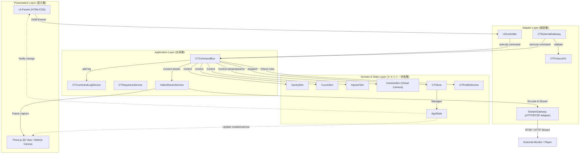
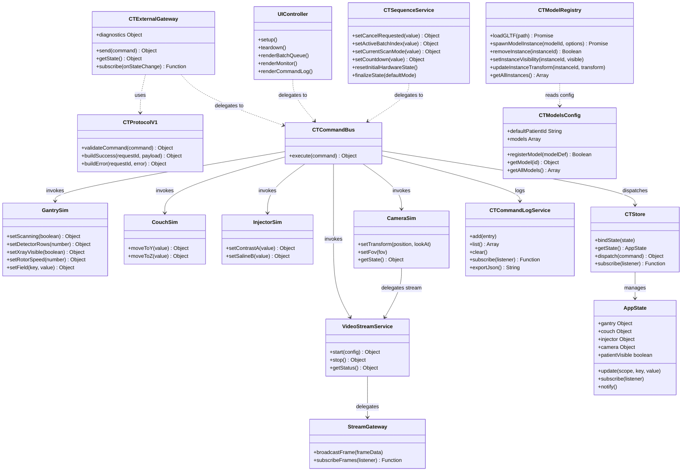
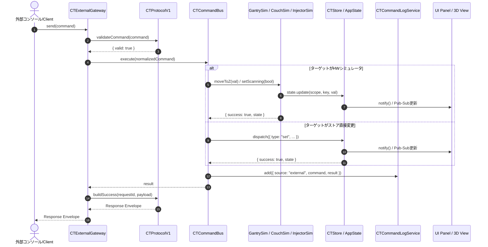
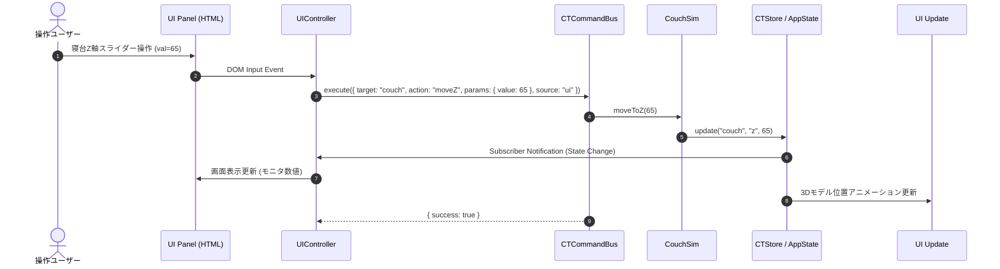
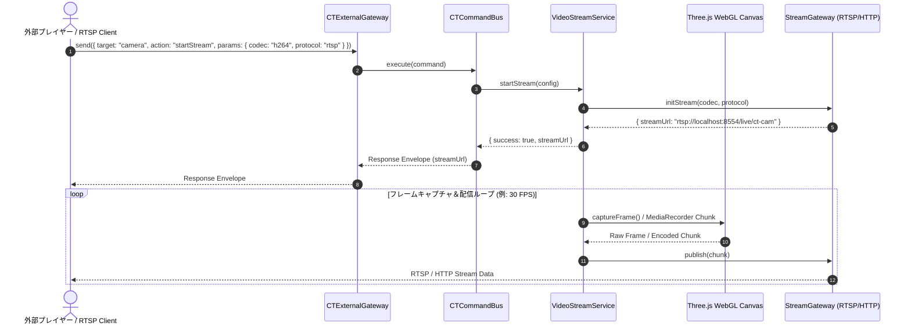
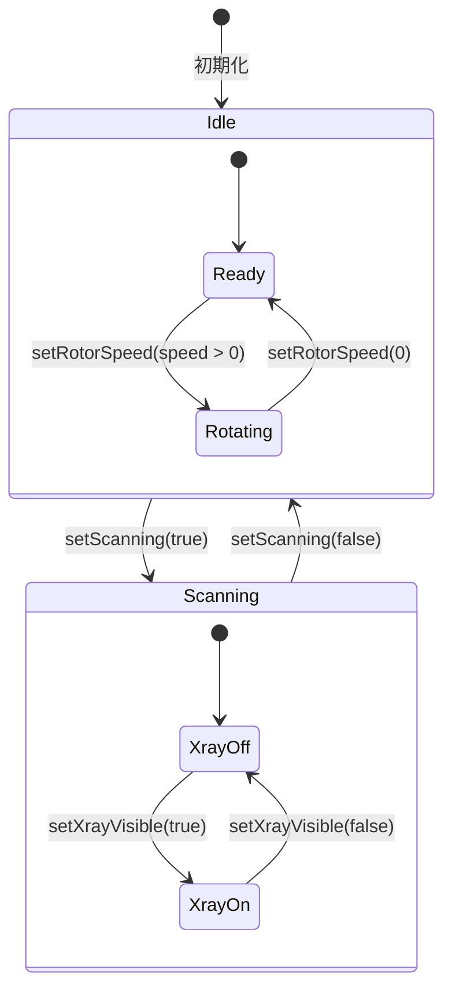
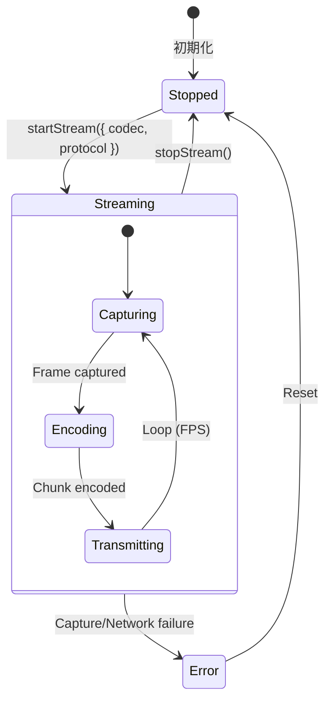

# CT 3D Simulator システム設計・アーキテクチャ仕様書

## 1. 設計原則
- **UIと外部I/Fの同一化**: UI操作および外部APIからの制御は、すべて単一の `Command Bus` 経路を経由して同一のロジックで実行する。
- **ドメインの独立性**: 仮想HWシミュレータ（Domain）と表示部（Presentation: 3D描画 / UIパネル）を完全に分離し、相互参照を排除する。
- **設定と実装の分離**: 検出器列数や回転速度制限などの機種差分は `ProfileService`（設定層）に切り出し、HWロジックと分離する。
- **単一状態管理 (Single Source of Truth)**: 全システム状態を `AppState` に一元管理し、`CTStore` の Pub/Sub 機構により画面・3Dモデルへ変更を伝播する。

---

## 2. アーキテクチャ概要 (コンポーネント図)

システム全体のコンポーネント関係およびレイヤ境界を以下に示します。



---

## 3. モジュール設計とインターフェース (クラス/モジュール図)

主要なモジュール、公開メソッド、および相互参照関係を定義します。



---

## 4. 制御フローとシーケンス

### 4.1 外部APIからのコマンド実行シーケンス

外部コンソール（JavaScript / Console App）から `CTExternalGateway` 経由でコマンドが発行され、状態が更新されるまでの流れです。



### 4.2 UI操作からのコマンド実行シーケンス

操作画面（UIパネル）上のボタンクリックやスライダー操作からコマンドが発行される流れです。



### 4.3 仮想カメラ映像配信シーケンス (カメラストリーミング)

`target: "camera"`, `action: "startStream"` が実行されてから動画ストリームが送出されるまでのシーケンスです。



---

## 5. 状態管理と状態遷移 (ステートマシン図)

### 5.1 ガントリ (GantrySim) スキャン動作のステートマシン

ガントリスキャンの内部状態および制御ルールを図示します。



### 5.2 仮想カメラ映像配信のステートマシン



---

## 6. 実装ディレクトリとモジュール構成

ソースコードのディレクトリ構成とモジュールの対応関係です。

```text
assets/js/
  ├── core/                           # ドメイン・アプリケーションコア
  │   ├── main.js                     # アプリケーション基盤エントリーポイント
  │   ├── state.js                    # AppState (状態管理実体)
  │   ├── store.js                    # CTStore (AppStateへのアクセサーラッパー)
  │   ├── hw/                         # 仮想HWドメインシミュレータ
  │   │   ├── gantry-sim.js           # ガントリ制御ロジック
  │   │   ├── couch-sim.js            # 寝台制御ロジック
  │   │   ├── injector-sim.js         # インジェクタ制御ロジック
  │   │   └── camera-sim.js           # 仮想カメラ制御ロジック
  │   ├── commands/
  │   │   └── command-bus.js          # コマンドバス（UI/外部共通の実行経路）
  │   ├── config/
  │   │   └── models-config.js        # 3Dモデル定義・登録管理
  │   ├── services/
  │   │   ├── sequence-service.js     # バッチシーケンス実行制御
  │   │   ├── command-log-service.js  # コマンド実行ログ管理
  │   │   ├── model-registry.js       # GLTFモデルローダ・インスタンス管理
  │   │   └── video-stream-service.js # 映像ストリーミング制御サービス
  │   └── profile/
  │       ├── default-profile.js      # 標準HWプロファイル
  │       └── profile-service.js      # 機種差分プロファイルサービス
  ├── adapters/                       # 外部接続・UIアダプター
  │   ├── ui/
  │   │   └── ui-controller.js        # DOMイベントハンドラ・画面同期
  │   ├── external/
  │   │   ├── protocol-v1.js          # 通信プロトコル検証・レスポンス生成
  │   │   └── external-gateway.js     # 外部公開API Gateway (window.CTExternalGateway)
  │   └── video/                      # 映像配信アダプター
  │       ├── canvas-capturer.js      # Canvasフレームキャプチャ・エンコーダー
  │       └── stream-gateway.js       # RTSP / HTTP ストリーミング転送アダプター
  └── view/models/                    # Presentation (Three.js 3D表現)
      ├── room-model.js               # 検査室・壁・床
      ├── gantry-model.js             # ガントリ3Dモデル
      ├── injector-model.js           # インジェクタ3Dモデル
      ├── control-room-model.js       # 操作室
      └── server-rack-model.js        # サーバーラック
```

---

## 7. UI構成・表示仕様

### 7.1 パネル構成と役割
操作画面は以下の5パネルで構成され、将来実コンソール画面へ接続する際にも各パネル単位で容易に換装できる設計としています。

- **Console (`panel-console`)**: スキャン開始/停止、バッチ編集、シーケンス実行
- **HW STATE MONITOR (`panel-monitor`)**: ガントリ・寝台・インジェクタ・直近結果表示
- **HW設定 (`panel-hw-config`)**: Detector Rows、Couch Y/Z、Injector A/B 設定
- **3D表示・操作 (`panel-3d-config`)**: フォーカス、カメラ、透過、X線、患者表示、カメラ配信設定
- **Command Log (`panel-command-log`)**: コマンド実行履歴表示

---

## 8. 仮想カメラ映像配信アーキテクチャ詳細

### 8.1 配信方式とプロトコル構成

| 方式 | コーデック | 通信プロトコル | 技術スタック・伝送方式 |
| :--- | :--- | :--- | :--- |
| **MJPEG Stream** | MJPEG (JPEG連番) | HTTP (`multipart/x-mixed-replace`) | HTMLCanvasElement `.toDataURL('image/jpeg')` または Blob 転送 |
| **H.264 Stream (RTSP)** | H.264 / AVC | RTSP (または WebSocket-RTSP ゲートウェイ) | `MediaRecorder` API (`video/mp4;codecs=avc1` / `video/webm`) ＋ RTSP リレー |
| **H.264 Stream (HTTP)** | H.264 | HTTP (HLS / Low-Latency HLS) | MediaSource Extensions (MSE) / HLS.js 互換セグメント生成 |

---

## 9. 検証方針
- **構文チェック**: `node --check`
- **外部I/Fプロトコル検証**: `node scripts/verify-external-interface.js`
- **映像配信検証**:
  - MJPEG over HTTP ストリームのブラウザ再生確認
  - RTSP ストリーム (VLC メディアプレイヤー / ffmpeg での受信確認)
