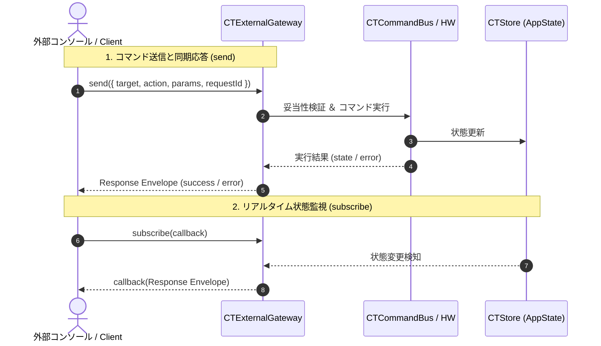

# CT Simulator 外部コマンドインターフェース仕様書 (v1)

## 1. 概要
本仕様書は、外部コンソールアプリケーション等から `window.CTExternalGateway` を介して仮想HW（ガントリ、寝台、インジェクタ、全体シミュレータ）を遠隔制御および状態監視するための通信プロトコル仕様です。

### 1.1 通信シーケンス (UML)



---

## 2. 公開API
`window.CTExternalGateway` オブジェクトを通じて以下のインターフェースを提供します。

| メソッド名 | 引数 | 戻り値 | 説明 |
| :--- | :--- | :--- | :--- |
| `send(command)` | `command: Object` | `ResponseEnvelope` | コマンドを発行し、同期的に結果を受け取る |
| `getState()` | なし | `ResponseEnvelope` | シミュレータ全体の最新状態を取得する |
| `subscribe(onStateChange)` | `callback: Function` | `unsubscribe: Function` | 状態変化時の自動通知を購読する（解除関数を返却） |

---

## 3. 電文構造 (スキーマ仕様)

### 3.1 リクエスト構造 (Command)
```json
{
  "requestId": "req-001",
  "target": "gantry",
  "action": "setScanning",
  "params": { "value": true }
}
```

| フィールド | 型 | 必須 | 説明 |
| :--- | :--- | :---: | :--- |
| `target` | `String` | 必須 | 操作対象 (`gantry` \| `couch` \| `injector` \| `simulator` \| `camera`) |
| `action` | `String` | 必須 | 実行するアクション名 |
| `params` | `Object` | オプション | アクション毎のパラメータオブジェクト |
| `requestId` | `String` | オプション | トラッキング用の任意のリクエストID |

### 3.2 レスポンス構造 (Response Envelope)
```json
{
  "requestId": "req-001",
  "success": true,
  "timestamp": "2026-07-31T13:30:00.000Z",
  "payload": { "gantry": { "isScanning": true } },
  "error": null
}
```

| フィールド | 型 | 説明 |
| :--- | :--- | :--- |
| `requestId` | `String \| null` | リクエスト時に指定されたID（未指定時は `null`） |
| `success` | `Boolean` | 処理の成否 (`true` / `false`) |
| `timestamp` | `String` | ISO-8601形式の処理実行日時 |
| `payload` | `Object \| null` | 成功時の実行結果・状態データ（失敗時は `null`） |
| `error` | `Object \| null` | 失敗時のエラーオブジェクト `{ code, message }`（成功時は `null`） |

---

## 4. サポートターゲット・アクション一覧

| ターゲット | アクション名 | パラメータ名・型 | 説明 |
| :--- | :--- | :--- | :--- |
| **`gantry`**<br>(ガントリ部) | `setScanning` | `value: boolean` | スキャン動作の開始 (`true`) / 停止 (`false`) |
| | `setDetectorRows` | `value: number` | 検出器列数を設定 (例: `320`) |
| | `setXrayVisible` | `value: boolean` | X線ビームの表示切替 |
| | `setRotorSpeed` | `value: number` | 回転速度を設定 |
| | `setField` | `key: string`, `value: any` | フィールド直接更新 |
| | `getState` | なし | ガントリの現在状態を取得 |
| **`couch`**<br>(寝台部) | `moveY` | `value: number` | 寝台の上下位置変更 (mm) |
| | `moveZ` | `value: number` | 寝台の前後位置変更 (mm) |
| | `getState` | なし | 寝台の現在状態を取得 |
| **`injector`**<br>(インジェクタ部) | `setA` | `value: number` | A剤（造影剤）注入量の設定 |
| | `setB` | `value: number` | B剤（生理食塩水）注入量の設定 |
| | `getState` | なし | インジェクタの現在状態を取得 |
| **`simulator`**<br>(全体制御) | `setPatientVisible` | `value: boolean` | 患者モデルの表示 (`true`) / 非表示 (`false`) |
| | `getState` | なし | 全体の現在状態を取得 |
| **`camera`**<br>(仮想カメラ・映像配信) | `startStream` | `codec: string` (`'h264'` \| `'mjpeg'`),<br>`protocol: string` (`'rtsp'` \| `'http'`),<br>`fps?: number` | 仮想カメラ映像のエンコードストリーミング配信を開始 |
| | `stopStream` | なし | 映像ストリーミング配信を停止 |
| | `getStreamUrl` | なし | 現在配信中のストリーミングURLを取得 |
| | `getState` | なし | カメラおよび配信状態を取得 |

---

## 5. エラーコード一覧

| エラーコード | 発生原因 | 対策・備考 |
| :--- | :--- | :--- |
| `VALIDATION_ERROR` | 電文形式不正、または必須パラメータ欠落 | `target`, `action`, `params` の記述を確認する |
| `TARGET_NOT_FOUND` | 指定された `target` が存在しない | 許可されたターゲット名 (`gantry` 等) を使用する |
| `UNSUPPORTED_ACTION` | 存在しない `action` 名の指定 | サポートアクション一覧表を確認する |
| `INVALID_DETECTOR_ROWS` | 未許可の検出器列数を指定 | `ProfileService` の許可値を確認する |
| `INTERNAL_ERROR` | 内部モジュール（CommandBus等）未初期化 | シミュレータの起動状態を確認する |

---

## 6. 使用例（サンプルコード）

```javascript
// 1. スキャン開始
const res1 = window.CTExternalGateway.send({
  requestId: 'req-001',
  target: 'gantry',
  action: 'setScanning',
  params: { value: true }
});

// 2. 寝台Z軸移動 (65mm)
const res2 = window.CTExternalGateway.send({
  requestId: 'req-002',
  target: 'couch',
  action: 'moveZ',
  params: { value: 65 }
});

// 3. リアルタイム状態監視の開始
const unsubscribe = window.CTExternalGateway.subscribe((event) => {
  if (event.success) {
    console.log('[状態更新通知]', event.payload);
  }
});
```
